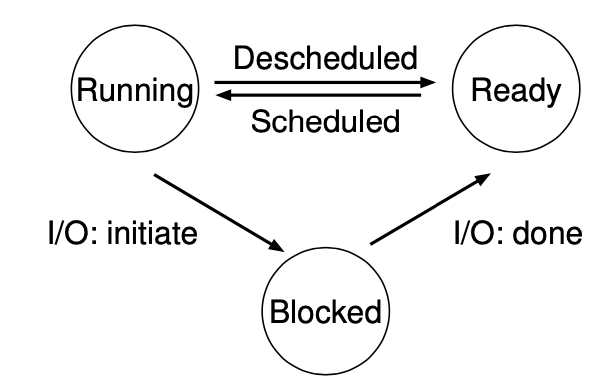

# The Abstraction: The Process

## 进程Process
A process is a **running program**.

## CPU virtualization
操作系统安排CPU运行一个进程后，停下来，切换到另一个进程继续运行。这种技术称为time sharing.

两个概念：
1. 上下文切换 Context switch: CPU从一个进程切换到另一个进程时，需要保存原来进程的信息，并且将新的进程的必要信息读取回来。这些信息包含，寄存器，页表，进程控制块等等。
2. Scheduling policy: 操作系统决定由哪个进程上CPU运算的算法

## 进程Process的组成有哪些
内存，寄存器，计数器，IO信息

## 进程API Process API
Create, Destroy, Wait, Miscellaneous Control, Status

## 创建进程 Creating a process
1. 操作系统首先要讲可执行文件载入内存
2. 为进程runtime stack分配内存
3. 为进程heap分配内存
4. IO相关信息，比如打开stdin,stdout,stderr

## 进程状态
1. Running 执行：进程正在执行
2. Blocked 阻塞：进程进行了某种操作使得它必须等待某个事件发生才能继续运行，比如，一个程序发出IO请求
3. Ready 就绪：程序可以执行，但是OS决定暂时不执行。比如OS为一个发出IO请求的进程完成了IO，在程序已经准备好继续执行了。



除此之外，进程还可能处于
4. Initial 初始：正在创建的进程处于初始态
5. Final 终止：已经退出，但尚未被清理的进程处于终止态，即僵尸进程，Zombie process.设置终止态的目的是使得创建本进程的父进程可以检查本进程的返回值，以检查进程是否顺利完成。父进程一般通过调用```wait()```或者```waitpid()```来等待子进程完成，并且告知OS子进程已经可以回收资源。

## 相关数据结构
1. 进程队列：通常系统维护就绪队列，阻塞队列。
2. Process control block (PCB) 进程控制块：PCB也可以成为process descriptor，用来存储进程的必要信息。

## Homework
[Homework solution](./homework/README.md)
