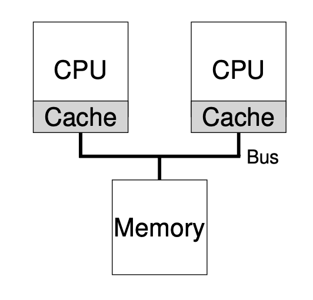

# Multiprocessor Scheduling
存在多个CPU时的调度。

## Multiprocessor Architecture
多个CPU共享内存，但不共享缓存

由于多个CPU不共享cache，因此可能导致内存中的相同数据读入到不同cache之后被修改成了不同的内容，这个问题被称为cache coherence 内存一致性问题。

## Synchronization
上锁

## Cache Affinity
如果进程被切换掉之后，被换到了另一个CPU上运行，会导致cache miss, 因此始终放在一个CPU上运行可以更好地利用Cache的特性。

## Single-Queue Multiprocessor Scheduling (SQMS)
将所有任务放在同一个队列中，各个CPU依次从中取出任务运行。简便易行。

缺陷：
1. Lack of scalability: 由于各个CPU共享同一个数据结构，因此每次修改队列都要上锁，降低了CPU的并行效果。
2. Lack of cache affinity: 每个任务上哪个CPU是随机的

## Mutli-Queue Multiprocessor Scheduling (MQMS)
系统维护多个就绪队列，每个任务按照一定规则进入各个队列。由于各个队列不共享数据，因此不用上锁。

缺陷：Load imbalance: 有可能某些队列很拥挤，某些队列几乎空白，这样并不能很好地利用CPU资源

解决load imbalance的方法是migration, 将较为拥挤队列中的任务转移到不那么拥挤的队列中。

