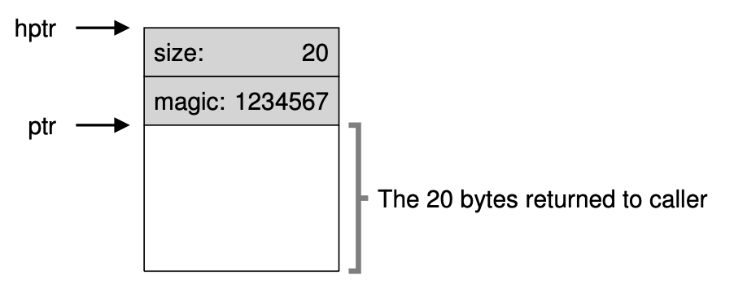

# Free-Space Management
## Assumptions
系统通过一个free list来管理heap上的内存。当然，这个free list未必是字面意义上的list, 有可能实际上是别的数据结构。
Assumpstions:
1. 这里主要讨论外部碎片。
2. 已经分配给用户的内存不会被relocate，即不允许compaction.
3. allocator管理一段连续内存，虽然allocator可以在内存不足的时候继续申请内存，这里为了方便不讨论这种情况。

## Low-level Mechanism
### Splitting and coalescing
系统的free list里面维护了一系列可供使用的内存。如果，此时用户要求一块内存，且小于free list的内存块，则系统需要split现有内存块。在用户释放内存的时候，如果被释放内存的临近内存块已经在free list之中，则我们应该将其合并然后再放入free list. 

### Tracking the size of allocated regions
```malloc```申请的内存并非仅包含用户要求的内存大小，通常还会包含一个header, 其中通常包含用户区域的大小和一些验证信息。


### Growing the Heap
当程序中已经有的Heap区域用尽时，可以向OS继续申请内存，UNIX中通过```sbrk```系统调用实现。OS在收到申请后需要找出可用物理内存，配置页表，然后将内存交给应用程序。

## Basic Strategies
1. Best Fit: 遍历free list, 找出最合适的内存块
2. Worst Fit: 遍历free list, 找出最不合适的内存块使用
3. First Fit: 遍历free list, 找出第一个合适的内存块，停下
4. Next Fit: 每次遍历都从上次分配的内存块往后找，而不是每次都从头开始遍历free list

## Other Approaches
1. Segregated Lists: 如果一个程序中经常用到某个大小的内存块，那么我们可以维护一个链表，其中每个内存块都是这个大小。其它大小的request再分别处理。
2. Buddy Allocation: 对于内存块反复除以2，直至得到一个最小适合的内存块。这种方式容易造成内部碎片。
3. 

