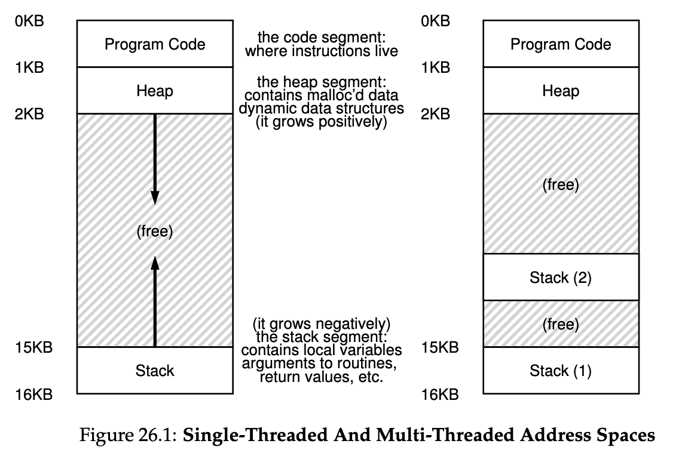

# Concurrency: An Introduction
简述线程的要点
* 线程thread与进程process在很多方面类似，不同之处在于，同一个进程中的不同线程共享内存空间，但不同进程之间一般不会共享内存。
* 每个线程拥有自己的程序计数器和通用寄存器内容，因此从一个线程切换到另一个线程需要上下文切换。但线程共享地址空间，因此同一个进程内的线程切换不需要切换页表。
* 进程的状态保存在进程控制块process control block (PCB)中，线程的状态保存在线程控制块thread control block (PCB)中。
* 多线程的进程的地址空间中有多个栈


## Why use thread?
1. Parallelism: 多线程程序增加并行度。
2. 避免程序因为发出IO请求而阻塞。当一个线程发出IO请求而被阻塞时，同一个进程中的另一个线程依然有可能上CPU运行，这样整个进程的运行效率得到了提高。

## An Example: Thread Creation
下面是一个多线程的例子。```main```函数中创建两个线程并且分别调用```mythread```函数打印给定的字符串。注意，为了方便起见，下面代码中的线程创建和回收都没有做检查。
```c++
// t0.c
#include <stdio.h>
#include <pthread.h>

void *mythread(void *arg)
{
    printf("%s\n",(char*)arg);
    return NULL;
}

int main(int argc, char const *argv[])
{
    pthread_t t1, t2;
    printf("main: begin\n");
    pthread_create(&t1,NULL,mythread,"A");
    pthread_create(&t2,NULL,mythread,"B");
    pthread_join(t1,NULL);
    pthread_join(t2,NULL);
    printf("main: end\n");
    return 0;
}
```
由于OS scheduler对于两个线程的运行顺序很难预知，所以上面的程序中有可能先打印出A，也有可能先打印出B.

## Shared Data
下面这段代码中，两个线程分别对同一个计数器进行加运算。
```c++
#include <stdio.h>
#include <pthread.h>

static volatile int counter = 0;

void *mythread(void *arg)
{
    printf("thread %s: begin\n",(char*)arg);
    for ( int i = 0; i < 100000; ++i )
        ++counter;
    printf("thread %s: end\n",(char*)arg);
    return NULL;
}

int main(int argc, char const *argv[])
{
    pthread_t t1, t2;
    printf("main: begin\n");
    pthread_create(&t1,NULL,mythread,"A");
    pthread_create(&t2,NULL,mythread,"B");
    pthread_join(t1,NULL);
    pthread_join(t2,NULL);
    printf("main: end\n");
    printf("counter = %d\n",counter);
    return 0;
}
```
理论上，最终计数器的结果应该是两个线程加法次数之和。但事实并非如此，下面是一次运行的结果，最终计数器的结果并不是我们所预料的，并且任意两次运行的结果都可能不同。
```bash
./t1.o
main: begin
thread A: begin
thread B: begin
thread A: end
thread B: end
main: end
counter = 109620
```

## Uncontrolled Scheduling
出现上面这种问题的原因是我们不知道OS会在什么时候进行上下文切换。有可能计数器的值在t1中被load到寄存器中，这时候系统切换到t2运行，t2把计数器load到寄存器中的时候，计数器还是原来的值。这种情况下，虽然t1, t2各加了一次，但总的结果却只相当于加了一次。

* Critical section: 在多线程程序中访问共享资源的代码称为critical section. 上面例子中对于counter的修改即为一个critical section.
* Lock: 对于critical section上锁可以使得一个线程访问critical section的时候禁止其它线程访问。

## Atomicity 原子性
具有原子性的code要么不执行，要么必须执行完，在执行期间不得中断。
