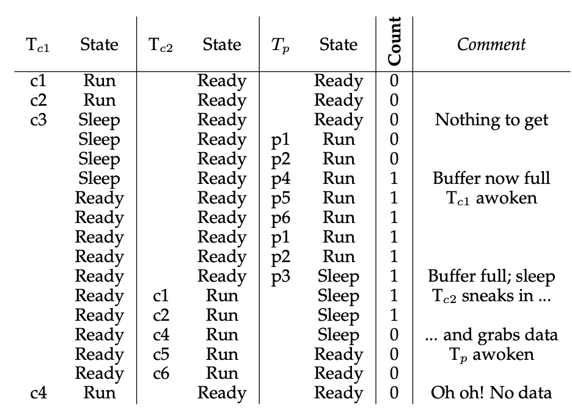
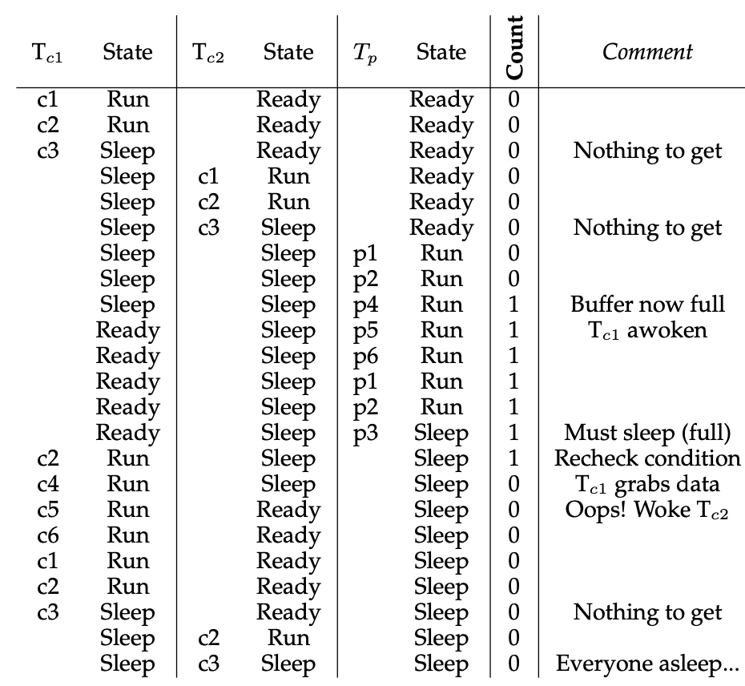

# Condition Variables 条件变量
条件变量是线程间通信的一种方式。

举例：如果一个父线程希望等待子线程完成之后再继续执行，要怎样做？

一个直接的方法是，父子线程共享一个flag, 然后父线程不断循环直至子线程完成。
```c++
// spin.c
#include <stdio.h>
#include <pthread.h>

volatile int done = 1;

void *child(void *arg)
{
    printf("I am child.\n");
    done = 0;
    return NULL;
}

int main(int argc, char const *argv[])
{
    pthread_t t;
    printf("Parent: begin\n");
    pthread_create(&t,NULL,child,NULL);
    while (done == 1);
    printf("Parent: end\n");
    return 0;
}
```
尽管上面这种方法浪费CPU资源，但是总是可以达到我们的目的。上面这个例子其实可以通过join来实现，但是如果parent thread期待child thread改变其它的什么条件，那join可能就不行了。

## Definition and Routines
条件变量是某种队列，当线程等待的状态不满足时可以将自身放在某个条件变量的队列中，放入队列的线程会休眠。而当另一个线程改变了某种状态时，会唤醒在等待中的线程。

下面这段代码中，我们使用条件变量配合一个互斥锁实现了```pthread_join```功能。
```c++
#include <stdio.h>
#include <stdlib.h>
#include <pthread.h>

int done = 0;
pthread_mutex_t mutex = PTHREAD_MUTEX_INITIALIZER;
pthread_cond_t cond = PTHREAD_COND_INITIALIZER;

void thr_exit()
{
    pthread_mutex_lock(&mutex);
    done = 1;
    pthread_cond_signal(&cond);
    pthread_mutex_unlock(&mutex);
}

void *run_child(void *arg)
{
    printf("Child: running\n");
    thr_exit();
    return NULL;
}

void thr_join()
{
    pthread_mutex_lock(&mutex);
    while ( done == 0 )
        pthread_cond_wait(&cond,&mutex);
    pthread_mutex_unlock(&mutex);
}

int main(int argc, char const *argv[])
{
    pthread_t child;
    printf("Parent: begin\n");
    pthread_create(&child,NULL,run_child,NULL);
    thr_join();
    printf("Parent: end\n");
    return 0;
}
```
这段代码中有下面几点需要注意
1. 这段代码中用到了两个与condition variable相关的函数```pthread_cond_wait```和```pthread_cond_signal```, 前者的作用是将自身休眠等待被唤醒，后者的作用是给休眠中的线程发信号将其唤醒。
2. 在parent中使用了```while ( done == 0 )```来判断子线程是否完成，而不是if语句。使用while的原因会在后面介绍到。
3. 为什么我们需要用到变量```done```来配合condition variable使用？考虑下面这种情况，
    ```c++
    void thr_exit()
    {
        pthread_mutex_lock(&mutex);
        pthread_cond_signal(&cond);
        pthread_mutex_unlock(&mutex);
    }
    void thr_join()
    {
        pthread_mutex_lock(&mutex);
        pthread_cond_wait(&cond,&mutex);
        pthread_mutex_unlock(&mutex);
    }
    ```
如果子线程被创建后立即执行，那么子线程调用```pthread_cond_signal```的时候并没有线程在等待这个条件变量，因此不产生效果。然后切换回父线程运行时，父线程调用```pthread_cond_wait```，并且永远不会被唤醒。这是我们需要一个flag来帮助我们的原因。
4. 为什么需要上锁？考虑下面的代码，
    ```c++
    void thr_exit()
    {
        done = 1;
        pthread_cond_signal(&cond);
    }
    
    void thr_join()
    {
        if ( done == 0 )
            pthread_cond_wait(&cond); // 假设有一个不用锁的API
    }
    ```
    如果父线程先运行```thr_join```, 此时```done = 0```, 所以父线程下一步应该调用```wait```。但这时切换到了子线程运行，```done```被设为1并且调用了```signal```, 接下里的场景与前面类似，由于子线程发出signal的时候，条件变量下没有等待的线程，因此没有效果。这时切换回父线程，父线程执行```wait```并且永远不会被唤醒。

## The Producer/Consumer Problem
Producer/Consumer 生产者/消费者问题，也称为Bounded Buffer 有界缓冲问题。这个问题中有 $\geq 1$个生产者和$\geq 1$个消费者，显然这些线程必须共享一定的资源才能完成从生产者到消费者的传递，因此线程间的同步是必要的。举例来说，Web服务器就可能存在一个主线程用来接收http请求，并将这些请求分发给一些列worker threads（消费者）。

我们先考虑最简单的情形，假设生产者消费者共享一个数buffer, 并且有一个技术器counter用来表示buffer里面是否放了数据，因此counter的值只能为0或1. 每当counter为0时，消费者不能再消费，但生产者可以生产，并将counter变为1. 而当counter为1时，消费者可以消费，并将counter设置为0, 但生产者不能再生产。这个counter其实可以视为复杂情况中buffer中传递数据的长度，这里讨论的只是一个简化情形。

### 完全不考虑线程
我们很自然地需要一组```put/get```函数用来修改counter的值，并且分别被生产者/消费者线程调用，
```c++
int buffer;
int counter = 0; // initially, empty

void put(int value)
{
    assert(counter == 0)
    counter = 1;
    buffer = value;
}

int get()
{
    assert(counter == 1)
    counter = 0;
    return buffer;
}
```
同时我们也需要一对生产者/消费者需要运行的任务用来生产和消费，
```c++
void *producer(void *arg)
{
    int *ntasks = (int *)arg;
    for ( int i = 0; i < *ntasks; ++i )
        put(i);
    return NULL;
}

void *consumer(void *arg)
{
    int *ntasks = (int *) arg;
    for ( int i = 0; i < *ntasks; ++i )
    {
        get();
        // do something
    }
    return NULL;
}
```
上面的四个函数显示了我们希望达到的目标，但是它们全部都没有考虑线程同步的问题。

### First Version 
```c++
int ntasks; // must be initialized somewhere else
pthread_cond_t cond;
pthread_mutex_t mutex;

void *producer(void *arg)
{
    for ( int i = 0; i < ntasks; ++i )
    {
        pthread_mutex_lock(&mutex);
        if ( count == 1 )
            pthread_cond_wait(&cond,&mutex);
        put(i);
        pthread_cond_signal(&cond);
        pthread_mutex_unlock(&mutex);
    }
    return NULL;
}

void *consumer(void *arg)
{
    for ( int i = 0; i < ntasks; ++i )
    {
        pthread_mutex_lock(&mutex);
        if ( count == 0 )
            pthread_cond_wait(&cond,&mutex);
        get();
        pthread_cond_signal(&cond);
        pthread_mutex_unlock(&mutex);
    }
    return NULL;
}
```
上面这段代码看似可行，但是有如下的问题。假设有一个生产者，和两个消费者。一号消费者先运行，由于count为0，所以这一号消费者休眠等待。这时生产者运行，并发出signal唤醒了一号消费者。但是，其实切换到了二号消费者运行，由于此时count=1，二号消费者可以正常运行，不用等待。然后再切换回一号消费者并运行```get()```的时候回出错。



这个问题可以概括为，*被唤醒的线程所等待的状态，在其被唤醒的时刻是一定满足的。但是，被唤醒的线程未必能立刻上处理机运行。所以，有可能从被唤醒到上处理机运行的期间，被唤醒的线程所等待的状态又不再满足了。* 为了解决这个问题，通常我们使用while而不是if决定是否等待。

另外，使用while还可以解决另一种问题spurious wakeups虚假唤醒。具体来说，某些系统中发出信号的时候会唤醒两个线程，这是由系统的实现决定的。于是这两个被唤醒的线程也会面临上面类似的问题。

### Version 2: While, Not If
```c++
int ntasks; // must be initialized somewhere else
pthread_cond_t cond;
pthread_mutex_t mutex;

void *producer(void *arg)
{
    for ( int i = 0; i < ntasks; ++i )
    {
        pthread_mutex_lock(&mutex);
        while ( count == 1 )
            pthread_cond_wait(&cond,&mutex);
        put(i);
        pthread_cond_signal(&cond);
        pthread_mutex_unlock(&mutex);
    }
    return NULL;
}

void *consumer(void *arg)
{
    for ( int i = 0; i < ntasks; ++i )
    {
        pthread_mutex_lock(&mutex);
        while ( count == 0 )
            pthread_cond_wait(&cond,&mutex);
        get();
        pthread_cond_signal(&cond);
        pthread_mutex_unlock(&mutex);
    }
    return NULL;
}
```
这一版本会导致死锁，下面是一个导致死锁的例子，


### Single Buffer Producer/Consumer Solution
死锁的原因在于生产者/消费者均使用同一个条件变量，我们可以让它们等待不同的条件变量来解决这一问题。
```c++
pthread_cond_t emtpy,full;

void *producer(void *arg)
{
    for ( int i = 0; i < ntasks; ++i )
    {
        pthread_mutex_lock(&mutex);
        while ( count == 1 )
            pthread_cond_wait(&empty,&mutex);
        put(i);
        pthread_cond_signal(&full);
        pthread_mutex_unlock(&mutex);
    }
}

void *consumer(void *arg)
{
    for ( int i = 0; i < ntasks; ++i )
    {
        pthread_mutex_lock(&mutex);
        while ( count == 0 )
            pthread_cond_wait(&full,&mutex);
        get();
        pthread_cond_signal(&empty);
        pthread_mutex_unlock(&mutex);
    }
}
```

### Final Version of Producer/Consumer Problem
综合以上的讨论，当我们可以把上面的代码扩展到定长Buffer而非单一Buffer的情况。最终版本如下，
```c++
// producer_consumer.c
#include <stdio.h>
#include <pthread.h>

#define MAX 10
#define NTASKS 10

int buffer[MAX];
int getIndex = 0;
int putIndex = 0;
int count = 0;

pthread_mutex_t mutex;
pthread_cond_t unfull, nonempty;

void put(int val)
{
    buffer[putIndex] = val;
    putIndex = ( putIndex + 1 ) % MAX;
    count++;
}

int get()
{
    int rc = buffer[getIndex];
    getIndex = ( getIndex + 1 ) % MAX;
    count--;
    return rc;
}

void *producer(void *arg)
{
    for ( int i = 0; i < NTASKS; ++i )
    {
        pthread_mutex_lock(&mutex);
        while ( count == MAX )
            pthread_cond_wait(&unfull,&mutex);
        put(i);
        printf("(%ld) put : %d\n",(long)pthread_self(),i);
        pthread_cond_signal(&nonempty);
        pthread_mutex_unlock(&mutex);
    }
    return NULL;
}

void *consumer(void *arg)
{
    for ( int i = 0; i < NTASKS; ++i )
    {
        pthread_mutex_lock(&mutex);
        while ( count == 0 )
            pthread_cond_wait(&nonempty,&mutex);
        int rc = get();
        printf("(%ld) get : %d\n",(long)pthread_self(),rc);
        pthread_cond_signal(&unfull);
        pthread_mutex_unlock(&mutex);
    }
    return NULL;
}

int main(int argc, char const *argv[])
{
    pthread_mutex_init(&mutex,NULL);
    pthread_cond_init(&unfull,NULL);
    pthread_cond_init(&nonempty,NULL);
    pthread_t p1,p2;
    pthread_t c1,c2;
    pthread_create(&p1,NULL,producer,NULL);
    pthread_create(&p2,NULL,producer,NULL);
    pthread_create(&c1,NULL,consumer,NULL);
    pthread_create(&c2,NULL,consumer,NULL);
    pthread_join(p1,NULL);
    pthread_join(p2,NULL);
    pthread_join(c1,NULL);
    pthread_join(c2,NULL);
    return 0;
}
```

## Convering conditions
考虑下面这段代码，
```c++
// how many bytes of the heap are free?
int bytesLeft = MAX_HEAP_SIZE;

// need loc and condition too
cond_t c;
mutex_t m;

void *allocate(int size)
{
    pthread_mutex_lock(&m);
    while ( bytesLeft < size )
        pthread_cond_wait(&c,&m);
    // do something
    pthread_mute_unlock(&m);
    return something;
}

void free(void *ptr, int size)
{
    pthread_mutex_lock(&m);
    bytesLeft += size;
    pthread_cond_signal(&c); // to whom?
    pthread_mutex_unlock(&m);
}
```
这段代码中定义了```allocate```和```free```两个函数，其中allocate用于分配内存，free用于释放内存。如果heap中可用内存少于allocate请求的内存，则调用allocate的线程休眠，等待其它线程调用free释放内存后被唤醒。但问题在于，调用free的线程应该唤醒哪一个休眠中的线程？

举例来说，假设当前Heap中可用内存为0，如果线程A要求100字节，由于没有足够内存，所以线程A会休眠。紧接着线程B要求10个字节，由于也不够，所以线程B也休眠。这时候，线程C释放了50个字节并唤醒了线程A，可是A要求的字节依然没有满足，所以线程A继续休眠。但是线程B并没有接受到线程C的信号也继续休眠。

如果线程C调用了```pthread_wait_broadcast```则可以唤醒所有在对性condition variable下等待的线程，这种情况叫做covering condition. 当然，唤醒相应condition variable下的所有线程也会有新的问题，即每个线程都要上处理器，浪费资源。


