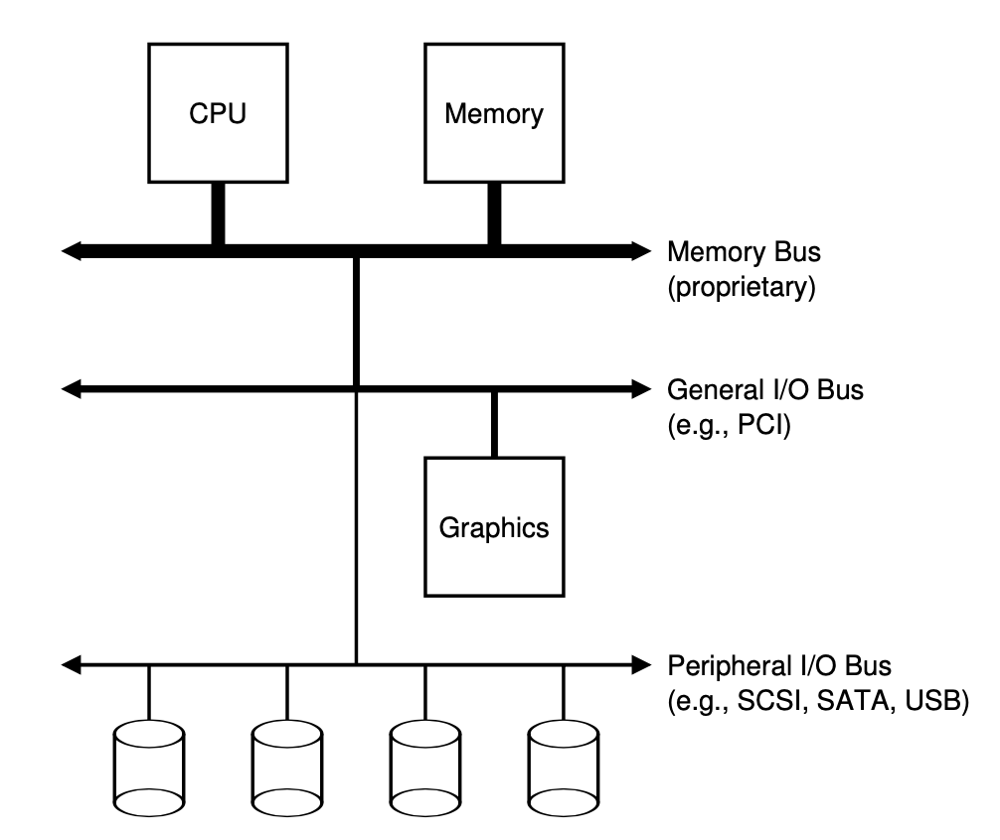
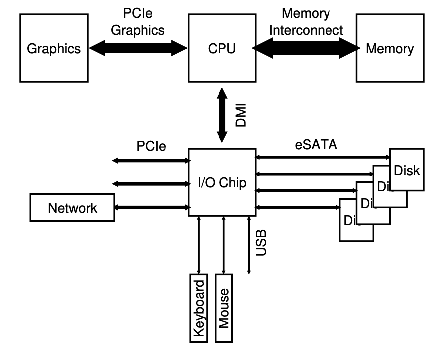
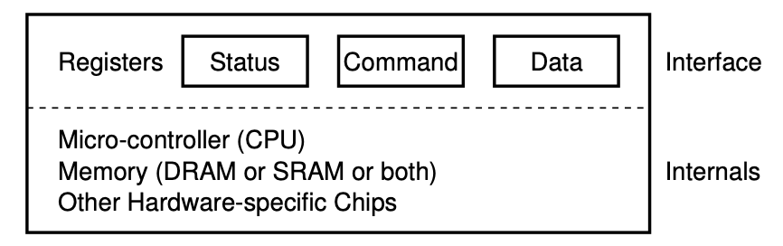
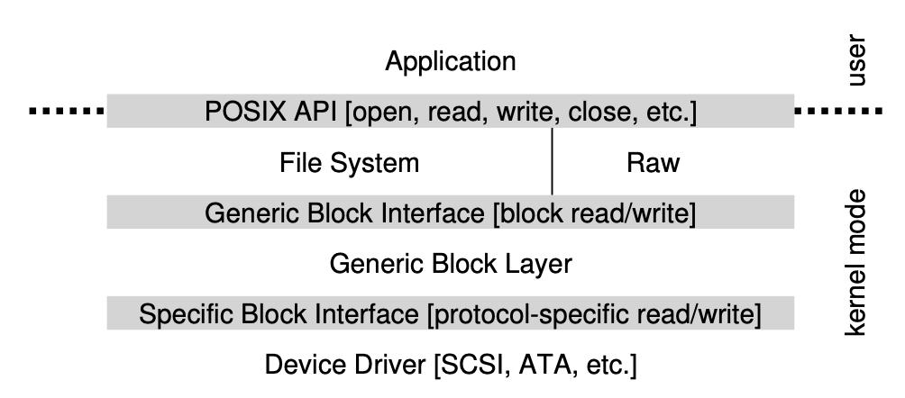

# IO Devices
## System Architecture
一个经典的计算机架构如下，

CPU与内存通过memory bus相连，某些设备通过PCI与计算机相连，其它设备通过peripheral bus与计算机相连，例如disk, mouse, keyboards. 使用这样架构的原因是与CPU相连越紧密的Bus速度越快但造价更高。

现代计算机CPU速度更快，因此CPU与内存采用点到点的连接来加快速度。并且使用一个IO芯片用来管理IO设备。


## A Canonical Device
A canonical device（常规的？）通常包含两个部分：接口 Interface 和 内部结构 Internal structures. 不同的设备需要向系统开放不同的结构，它们可能也使用不同的协议。Internal structure用来实现这个device想要展示给操作系统的功能。


## A Canonical Protocol
在上图中，接口部分包含了status, command, data三个寄存器，OS通过在这三个寄存器中读写即可以控制设备的行为。

一个简单的protocol,
```
While (STATUS == BUSY)
    ; // wait until device is not busy
Write data to DATA register
Write command to COMMAND register
    (starts the device and executes the command)
While (STATUS == BUSY)
    ; // wait until device is done with your request
```
上面这个protocol包含了四个步骤，
1. 如果设备繁忙，OS需要等待设备。询问设备是否繁忙的操作称为polling
2. 向data寄存器中写入数据
3. 向command寄存器中写入命令用来操作数据
4. 继续等待设备完成要求的操作

上面这种协议中需要CPU的不断介入，因此称为programmed IO (PIO). 同时，PIO导致IO的过程需要CPU的不断介入，这是一种对于资源的浪费。

## Lowering CPU Overhead With Interrupts
为了避免polling, 操作系统的做法是将发出IO请求的进程阻塞，然后切换到另一个进程运行。当设备满足相应的要求时，发起一个hardware interruption. 这时OS调用相应的interruption handler来处理中断。这样的做法使得CPU不用真得

当然，如果一个设备的速度非常快，那么让CPU等待反而速度会比两次进程切换要快。因此可以考虑先polling，然后再中断，这是一种two-phase approach.

另一个问题是livelock, 如果系统中频繁收到设备的中断，那么系统一直忙于处理中断而使得程序无法继续运行。这样的情况或许可以通过Coalescing（聚合？）来优化：将多个interruption批量地发送给OS的优化方法，而不是一个一个地发送。

## More Efficient Data Movement With DMA
PIO需要CPU介入来把数据和命令写入设备的寄存器，但是这个工作相对简单，因此使用CPU有些大材小用。解决这个问题可以使用Direct Memory Access(DMA). DMA是一个专门的设备，用于在内存和设备间搬运数据，并且很少需要CPU介入。

## Methods of Device Interaction
OS如何与Device通信？现在有两种方法，
1. IO instruction: 硬件要提供给OS与设备中寄存器通信的指令，每当有IO请求时，OS需要调用这些指令。当然这种指令只有内核态才有资格运行。
2. Memory-Mapped IO: 这种方法将设备寄存器抽象为内存地址，这样OS只需要用操作内存的指令就可以操作设备寄存器。
这两种方法现在都在使用中。

## Fitting Into the OS: The Device Driver
OS对devices也进行抽象，用户只能看到某些接口，而看不到设备的细节。OS对设备直接操作的代码称为device driver设备驱动。例如，下图是针对disk设备的抽象，



