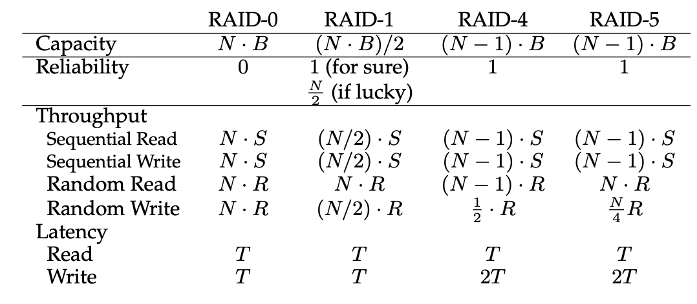

# Redundant Arrays of Inexpensive Disks (RAID) 廉价磁盘冗余阵列
从外界看来，RAID像是一个磁盘，但是他们的内部复杂，有多个磁盘，并有处理器来管理这些磁盘。

优点：
1. 由于有多个磁盘，RAID可以并行地读数据，因此速度更快。
2. RAID的容量大。
3. 可靠性高，RAID的冗余可以用于备份。

## Interface and RAID Internals
RAID对外显示为一个普通的硬盘。每当操作系统发出IO请求，RAID内部要管理物理IO要在哪些磁盘的哪些位置进行。

## Fault Model
Fail-stop fault model: 一个磁盘可以处于working和failed两种状态，一旦处于failed状态，我们假定磁盘永远丢失。Fail-stop model同时假定，一个硬盘出错可以很容易被检查到。

## Evalute A RAID
* Capacity: 给定N个磁盘，每个磁盘大小为B，它们构成的RAID的容量为多少？
* Reliability: 一个RAID可以允许多少disk faults
* Performance: RAID的速度如何

## RAID Level 0: Striping(条纹)
RAID0实际上不设置任何冗余，它只是把数据分散到不懂的磁盘上，从而可以利用多个磁盘并行读写。

* Chunk size: RAID0以chunk size为单位，将文件分散到不同磁盘上。如果chunk size很小，那么文件内并行度高，但是positioning time会很长；如果chunk size比较大，那么文件内并行度低，但是positioning time会减小。

* Capacity: 在RAID0中，如果有N个硬盘，每个硬盘大小为B，那么RAID0的容量为NB.
* Performance: 假设单个磁盘顺序读写的速度为S, 随机读写的速度为R. 那么RAID0的速度为NS和NR.

## RAID Level 1: Mirroring
RAID1将一般的磁盘用于存储，另一半磁盘作为备份。这样capacity减半，读写速度减半，但RAID1可以容忍disk failure因此更加可靠。

## RAID Level 4: Saving Space With Parity
RAID4将一部分磁盘用于存储其它磁盘信息的验证信息，这部分磁盘称为parity. 每当有disk failure发生时，parity可以用来计算丢失的信息。

RAID4 可以允许一个硬盘丢失而不丢失任何信息，因此可靠性高。

## RAID Level 5: Rotating Parity
RAID5中的parity信息也分散到各个磁盘中。这样可以更好地利用各个磁盘来并行读写。

## Summary
下面汇总了本节介绍的几种RAID的各自特点。

