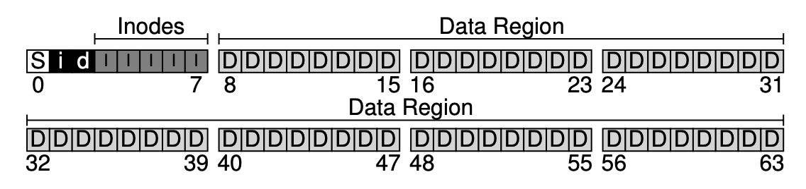

# File System Implementation
本节介绍一个简单的文件系统的实现，Very Simple File System (vsfs).

## 两个关键问题
理解一个文件系统需要考虑两个关键问题：
1. 实现文件系统的底层数据结构 Data structre
2. 文件系统的访问方式 Access methods: 即系统调用```open```, ```write```, ```read```等等如何在文件系统中实现，以及它们的效率如何？

## Overall Organization
首先，disk被分割成一个个的小单元，称为Block. 例如下面的例子中含有64个block, 我们假定每个block大小为4KB, 因此这是一个极小的硬盘。


我们在这些block中预留出一部分用于保存数据，即上图中的D blocks. 在数据之外，硬盘还需要保存每个文件的metadata, 文件的metadata具有一种被称为inode的数据结构。因此，我们还要在硬盘中分配一部分空间用于存储inode, 即上图中标记了I的那些block, 硬盘上的这一部分也称为inode table. 

在拥有了存储数据和metadata的空间之后，我们需要一部分空间用于存储，D blocks 和 I blocks是否被使用，这中数据结构被称为allocation structure. 管理硬盘中空闲空间的策略有多种，例如可以维护一个free list. 这里我们介绍一种常见的数据结构bitmap, bitmap包含两部分data bitmap和inode bitmap, 即上图中的i和d block. Bitmap中可以很方便地用相应位上的0或1来标志相应的inode region和data region是否被使用。

最后，我们还要有一个superblock用于存储这个文件系统的信息。当系统使用mount挂载一个文件系统时，即读取superblock中的内容。上图中的S即是superblock.

## File Organization: The Inode
inode是文件系统中最重要的数据结构，inode是index node的简称。每个inode可以用一个数字来指代，被称为i-number, 也是文件的底层名称low-level name. 根据i-number可以计算出inode在硬盘中的位置，从而读取inode中的信息。

inode中存储的是文件的metadata, 包括保护信息，大小，类型等等。此外，inode中最重要的信息是文件中数据的实际存储位置。

### Multi-Level Index
inode中如果只保存指向某个data block的指针，那么文件大小无法超过一个data block的大小。为了能存储更大的文件，我们可以使用多级index。例如，inode中存储一个indirect pointer, 这个indirect pointer指向一个data block, 这个data block中并不真得存储数据，而是存储指向下一级真正存储数据的block的指针。这个思路还可以继续下去，增加更多级的指针就意味着文件系统可以容纳的单一文件的大小增加。

在实践中，inode中存储多个direct pointer和一个indirect pointer, 当文件大小超过某个值的时候，inode启用indirect pointer存储，否则使用direct pointer存储。这种imbalanced结构的出发点是实践中大部分的文件都是小文件，往往用几个direct pointer就足以存储。

## Directory Organization
Directory可以视为一种特殊的文件，因此在文件系统中每个directory也拥有一个inumber. 目录中包含文件和子目录的名称和相应的inumber. 当然，不同的系统还还可能包含其它必要信息，但最名称和inumber是必须的。

当目录中删除文件时，即unlink操作，将文件的inumber设置为预定的值，例如0。当目录中增加文件中，需要扫描所有名称，确保不重名。有些系统中在每个目录中使用B树，这样遍历文件的速度更快。

## Free Space Management
文件系统需要管理可用的空间，当有新的文件或目录被创建时，文件系统要分配相应的空间。在我们的vsfs中，文件系统需要扫描bitmap来寻找可用的空间。

在真实的系统中，可能还要试图寻找连续的磁盘空间用于存储，因为这样读写更快。这样的策略在Linux下的ext2, ext3文件系统中都有使用。

## Access Paths: Reading and Writing
## Reading A File From Disk
首先，文件系统根据路径找到相应文件的inumber. 在寻找的过程中，文件系统要逐级找到文件夹的inumber, 读取文件夹的inode, 读取inode中指向的data block，重复这一过程直至找到我们希望的文件的inumber和inode, 读取inode, 载入内存。

每当操作系统发出一次读操作，文件系统读取inode中的内容，然后再读取inode指向的data blocks.

### Writing A File To Disk
寻找文件的过程与上面相似，如果文件存在，则打开；否则要创建文件。

写的过程，往往需要申请新的磁盘空间。因此在写的过程中，首先要读取文件的inode, 如果需要申请新的空间，那么文件系统需要读取data bitmap, 修改bit map, 将数据写入申请到的空间中，最后更新文件的inode中数据。

可见，完成用户的一次IO操作，文件系统底层会做许多次IO操作。因此，因此必然要采取措施来加快IO操作。

## Caching and Buffering 
为了提高效率，系统会考虑将常用的Block缓存到内存中。早期的系统中使用fixed-size cache, 并使用LRU算法来决定哪些Blocks留在内存中。但是这种固定大小的缓存可能会造成内存浪费。

现代系统中使用动态分配dynamic partitioning. 它们将虚拟内存和文件系统中的page视为unified page cache, 这样的操作更加灵活。显然，读取速度更快。而当写发生时，内存中的内容先改变，在一段时间后再批量地将内容写到硬盘中。

当然，推迟写入硬盘的操作也会有问题，例如，若buffer中的内容被修改后，系统崩溃，那么磁盘中的数据不是最新的数据。这种问题在类似于数据库之类的软件中无法容忍，因此有时需要在写之后强制要求刷新缓冲区。


