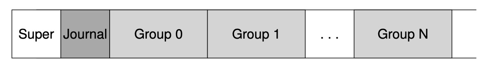
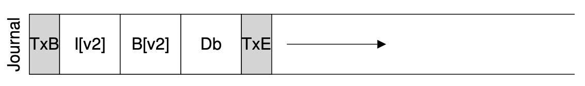

# Crash Consistency: FSCK and Journaling
本节介绍crash-consistency problem. 

## A Detailed Example
假如我们发出了一条向某个文件中写入的要求，而此时该文件现有的磁盘空间无法写入所有内容，因此文件系统需要分配新的磁盘空间以便写入。这个过程可以分为三个部分，
1. 在data bitmap中找到某个空闲的区域，将其修改为被使用
2. 在分配的data block中写入数据
3. 在文件的inode中更新direct/indirect pointers
这三个步骤发生的先后顺序不确定，且这三个步骤无法设置为原子操作。如果三个步骤没有全部完成的情况下，发生了crash, 例如系统崩溃，系统断电等等，那么此时磁盘中的内容是inconsistent的，因此会出现错误。

下面是几种crash的情形，
1. 如果bitmap被修改了之后Crash, data block尚未写入数据，inode尚未更新。则系统中出现了space leak, 即bitmap中标记了某个空间被使用，但实际上并没有；而inode中并没有指向这个区域，因此这个区域永远不会被释放。
2. 如果在更新了inode之后crash, 其它两个操作没有完成，此时inode指向的空间中没有写入数据，并且bitmap中没有把这个区域标记为被使用，所以在将来还会被其它文件使用。
3. 如果data block写入后crash，另外两个操作没有完成。由于Inode中没有指针指向这个区域，因此文件不完整，并且bitmap还可能把这块区域分配给其它文件。
如果三个操作中完成了两个同样也会有三种磁盘内容不一致的情况。总之，这个三个操作如果没有全部完成，文件系统就会不一致。

## Solution 1: The File System Checker (FSCK)
早期系统中采取一种lazy的策略，即允许文件系统中不一致的发生，然后再修复不一致。UNIX下的fsck工具就是为了寻找不一致并将其修复。当然，fsck并不能解决所有的不一致性。例如，crash发生在bitmap和inode更新之后，data block中尚未写入数据。此时，看上去没有不一致性，但data部分是garbage数据。

通常fsck在文件系统被挂载之前运行，这样可以保证提供给用户使用的文件系统消除了不一致性。

fsck大致会做如下的检查：
1. 检验superblock中的信息是否合理，比如空间大小
2. Free blocks: fsck扫描所有inode中的指针，并且将他们与bitmap对比，如果矛盾则修改Bitmap以符合inode中的信息
3. Inode state: 检查inode中的信息是否合理，例如文件类型是不是r,l,-中的一个
4. Inode links: 检查inode中的reference count，如果为0则用户无法在文件系统中访问到。
5. Duplicate: 检查是否多个Inode指向同一个block
6. Bad blocks: 检查inode中的指针是否合理，如果某个指针超出了硬盘空间的大小，那么这样的指针显然是错误的
7. Directory checks: fsck无法理解文件中的内容，但是可以检查文件夹中的内容，例如是否包含了.和..等等

fsck在一定程度上可以修复文件系统中的不一致问题，但是fsck速度慢，效率低，是对资源的浪费。

## Solution 2: Journaling (or Write-Ahead Logging)
这是一个从数据库中借鉴来的方法，现代的文件系统都使用了write-ahead logging的策略，例如Linux的ext3, ext4和windows下的NTFS. Write-ahead logging在更新磁盘内容之前，先将需要进行的操作写到磁盘中的某个特殊位置，称为logging. 一旦磁盘crash，在系统重启之后，磁盘还可以到Logging中找到相应的操作重新执行

下面以Linux的ext3文件系统为例，ext3将磁盘分割为superblock， Journal (Logging)和若干block groups, 每个block group包含inode bitmap, data bitmap, inode, data. (见下图)

### Data Journaling
在将数据写入硬盘之前，我们先将数据写入journal区域，如下，

TxB中包含这次transaction(数据处理)的必要信息，例如I[v2], B[v2]和Db区域的范围，以及transaction indentifier (TID). TxE中标志这个数据处理的结束，其中也包含TID. 在这个transaction写入journal之后才会将数据写入硬盘。

总的来说，这个过程包含两步，
1. Journal Write: 将transaction写入journal, 包括transaction开始，数据，metadata, transaction结束等等
2. Checkpoint: 将journal中要求的操作写入文件系统，成功写入之后，我们将这个状态称为一个checkpoint

这个过程看似美好，但是还有问题。在向硬盘写东西的时候，系统可能有自己的scheduling策略，从而并不会按照用户想象的顺序写入内容，这有可能导致在写入transaction的过程中发生了crash。想象一下这样的场景，如果TxB, I[v2], B[v2], TxE中的数据都已经写好，但是Db中数据还没有写好，那么在crash之后重启写入硬盘的内容是错误的。 为了解决这个问题，系统采取的策略是，先将除了TxE之外的部分写入，只有当其它部分完成之后才写入TxE，并且TxE的写入具有原子性。这个步骤称为Commit transaction, 只有commit之后才可以将数据写书文件系统。

于是，此时写文件的过程分成了三步
1. Journal write: 写入TxB, metadata和data写入journal之中
2. Journal commit: 在上一步完成后，将TxE写入journal
3. Checkpoint: 更新磁盘中的数据

### Recovery
如果crash发生在journal commit之前，那么系统重启之后忽略这样的transaction; 如果crash发生在journal commit之后，那么系统重启之后重复这些transaction直至完成checkpoint.

### Batching Log Updates
如果我们需要创建两个文件，并且第二个文件操作进入journal的时候，第一个还没有写入文件。此时很有可能会导致第二个文件覆盖了第一个文件。

因此文件系统会维护一个global transaction用于汇总一段时间内的transaction，然后一次性将它们全部写入硬盘，这样不会导致覆盖写。

### Making The Log Finite
由于journal的大小有限，因此在某个transaction写入硬盘之后，它所占的空间应该在某个时刻被释放，并被循环利用，因此journal也称为circular log.

到此，将数据写入硬盘的操作包含四步，
1. Journal write
2. Journal commit
3. Checkpoint
4. Free: 释放已经成功写入磁盘的transaction占据的空间
   
### Metadata Journaling
上面四步的写入方法是可以运行的，但有一个问题，即数据要首先写入journal中，然后再写入到硬盘中的相应位置。这意味着系统的每次写操作都要把数据在磁盘中写两遍，这会大大降低磁盘的效率。

为了提高效率，metadata journaling只把inode的修改(I[v2])和bitmap的修改(B[v2])写入journal, 而data直接写入磁盘中的相应位置。其顺序如下，
1. Data Write: 直接将数据写入磁盘中的相应位置，等到这一步完成后再进行下一步
2. Journal metadata write: 向journal中写入transaction，只写入TxB和metadata
3. Journal commit: 写入TxE
4. Checkpoint metadata: 根据metadata更新磁盘中的内容
5. Free: 释放transaction的空间

### Tricky Case: Block Reuse
当系统交替出现删除创建写入等操作，而crash又发生时，由于新创建的文件可能重复利用被删除文件使用的Block, 这会造成意外的错误。有多种方法可以解决这类问题，例如可以要求被删除文件的Block必须等到删除操作checkpoint之后才可以被重复利用。Linux的ext3文件系统为删除操作写入revoke (吊销)record到Journal中，当系统crash并重启之后，文件系统先处理用revoke标记的那些transaction.

## Solution 3: Other Approaches
* Soft Updates: 这种方法在写入的时候要先对写操作进行一定的排序最终保证不会出现不一致，但是这种方法难以实现
* Copy-on-write COW
* backpointer-based consistency BBC: 每个Block中增加指向inode的指针，因此可以比较inode的指针和block中的指针来判断是否有不一致
* Optimistic crash consistency

