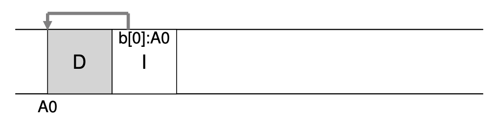
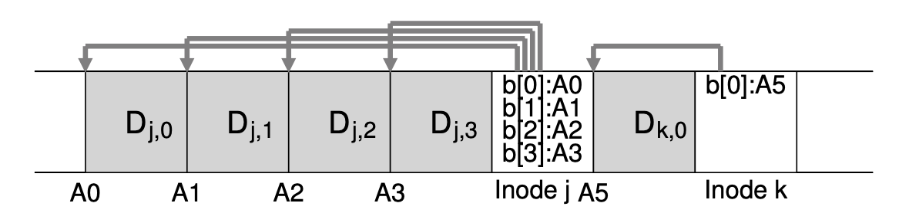
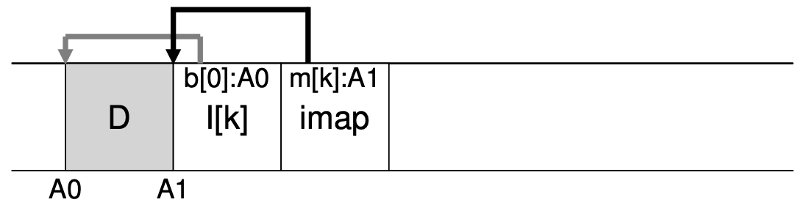
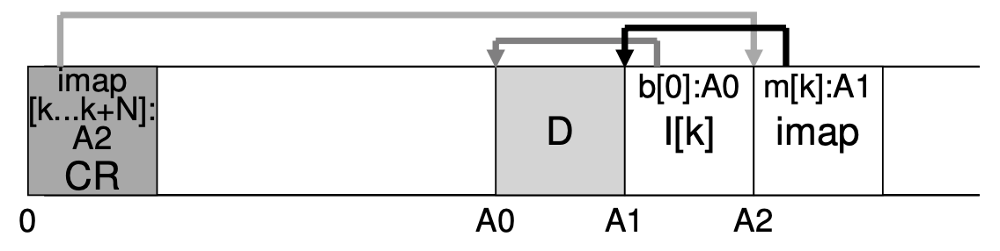
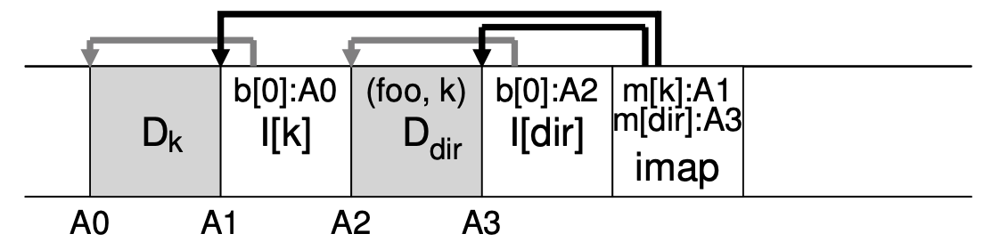

# Log-structured File Systems
进入90年代之后，人们观察到了如下的现象，
1. 内存越来越大，因此很多读操作都可以放到内存中缓存，因此磁盘的性能的瓶颈在于它的写操作
2. 磁盘的顺序读写和随机读写的性能差距很大
3. 当时已经存在的系统有很多问题，例如Fast File Systems FFS对于任何一次逻辑写入都要进行许多次物理写入。
4. 文件系统不区分普通磁盘和RAID，因此使用于普通单个磁盘的文件系统并不能充分利用RAID的特性。

Log-structured File System (LFS) 就是在上述的历史背景下产生的。LFS在内存中维护一个分块(segment), 每当系统发出写命令时，LFS会将data, metadata缓存到这个segment之中，之后再将segment中的内容写入磁盘中的一段未使用的空间。LFS从不覆盖写入数据。由于LFS每次写入的数据量都较大，因此可以充分利用RAID的性能。

## Writing To Disk Sequentially
LFS向磁盘中写入一个block之后，都会在其后紧跟着写入metadata, 即inode, 并且inode会指向它前面的data block.


## Writing Sequentially And Effectively
为了使得连续写入的效率更高，LFS会现在内存中缓存需要写入的内容，然后一次性将其写入磁盘，这种write buffer在LFS中被称为segment, 但是注意与内存分块的那个segment并不是一回事。

下图中连续写入四个data block，然后再inode中设置指向data block的指针。


## How Much To Buffer?
每次写入都需要考虑硬盘的寻道时间和写入数据的时间，因此一次性写入的数据越大，摊匀后寻道时间所占的比例越低，这样可以更加高效地利用硬盘的带宽。（但是，显然也不能太大。。。）

## Problem: Finding Inodes
由于LFS中所有的inode都被分散地存储到磁盘中的不同位置，因此我们需要根据inumber查找inode的位置。

### Solution Through Indirection: The Inode Map
LFS中引入了一种数据结构称为inode map (imap), imap可以根据inumber映射到**最新版本**的inode在硬盘中的地址。可以想见，imap拥有类似于虚拟内存页表的形式。

imap需要在硬盘中持久地存储，所以我们需要问，imap应当存储在硬盘中的什么位置？LFS的做法是，在写入数据之后立即写入inode，在inode之后立即写入imap. imap中存储inode的地址，inode中存储data的地址。如下图，

之所以imap也要分散存储，原因在于imap中的信息可能会频繁更新，因此imap与数据和inode放在一起连续存储会有更好的性能。

### Completing the Solution: The Checkpoint Region
由于imap同样分散存储，因此我们还是需要想办法查询imap的位置。LFS中在硬盘上开辟了一块称为checkpoint region的区域，在其中存储imap的起始地址。如下图，

由于checkpoint region中的内容并不会特别频繁地更新，因此它不会特别影响性能。

## Reading A File From Disk
当系统启动的时候，系统会先读取checkpoint region, 然后再读取所有的imap到内存中。每当需要读取某个文件时，系统只需要根据inumber在内存中查询imap即可。

## What About Directories
LFS中的目录下和前面几节的目录类似，它们包含一系列name到inode number的映射。每当创建一个新的文件，LFS需要创建data region, inode, 并且在imap中增加信息。

下面是一个文件夹的例子，

当我们希望使用```dir/foo```文件时，系统先通过imap查找到dir文件夹的inode(A3), 根据inode中的指针查找dir中存储的内容（A2), 并且在dir存储的内容中通过成对数据(foo,k), 找到了foo的inumber k, 这时系统再次通过k在imap中查找到foo的inode(A1), 根据inode中的内容查找到foo中的数据(A0).

在LFS中，如果一个文件的inode位置改变，LFS只需要修改imap中的信息，而不需要需改文件夹下的数据对。加入需要修改数据对，那么结果会导致，我们需要修改整个文件路径中的所有文件夹，这显然不是聪明的做法。

## Garbage Collection
由于LFS不会覆盖写之前的文件，它总是将内容被修改的文件写到新的磁盘位置上。这导致原来位置的文件失效，因此需要被回收，所以LFS会在后台中周期性地运行清理磁盘的任务。

由于LFS在写入硬盘的时候是按照segment写入的连续的成块的磁盘空间，LFS在清理的时候也会成块地扫描，将M个segment压缩成N个segment (N < M). 

那么LFS在扫描的时候如何知道哪些位置应该被清理，哪些不应该被清理呢？或者用LFS中的术语，哪些位置是活着的live?

## Determining Block Liveness
LFS在每个segment的开头设置一个segment summary block. 根据segment summary block中的内容可以计算出某个block是否正在被使用。

## A Policy Question: Which Blocks to Clean, And When?
通常LFS周期性地清除死掉的block或者在disk已经满了的时候进行清除。

当进行清理的时候，通常倾向于清理那些不怎么使用的cold segment, 而不清理那些hot segment.

## Crash Recovery And The Log
没看懂。。。Anyway， LFS也可以处理crash-consistency problem

