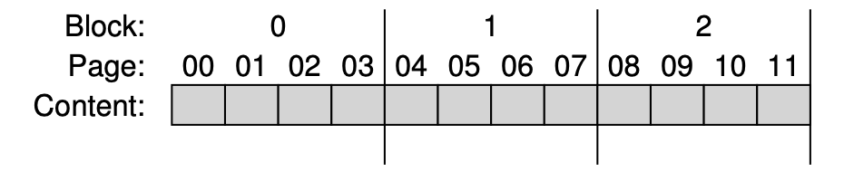
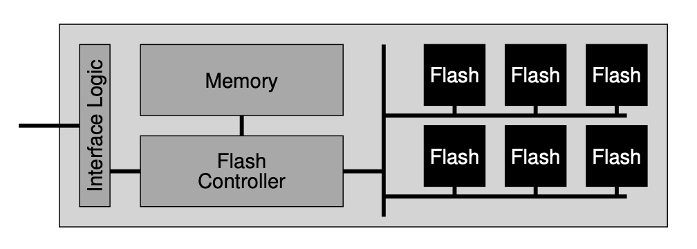

# Flash-based SSDs
固态硬盘中没有磁盘式的机械结构，它有晶体管构成，与内存类似。与内存不同的是，固态硬盘可以在断电之后保存其中的数据，因此可以用于数据的持久化。

## Storing a Single Bit
在single-level cell(SLC)式的闪存中，每个transistor只能存储一个bit，即高低电位。但multi-level cell (MLC)中，每个transistor有多种电位，因此可以存储多个bit。总的来说，SLC的性能更好，但价格更贵。

## From Bits to Banks/Planes
闪存由多个Planes构成，plane也称为bank. 每个bank中包含许多block, 每个block包含许多pages. Pages中包含实际的内容。闪存为了在一个page中写入数据，必须先将page所在的block中的内容全部擦除。下图中是一个bank的例子，

一个block大小通常为128KB或256KB. 一个page的大小通常为几个KB, 例如4KB.

## Basic Flash Operations
* Read: SSD读取任何一个page的速度都很快，几乎与上一个位置无关，因此接近于一种random access的存储器。
* Erase (a block): SSD在写入任何一个page之前都要讲整个block擦除，擦除的过程比较耗时。并且在擦除之前要将数据拷贝出去。
* Program (a page): SSD向page中写入内容的操作称为program a page. 写入的过程比擦除要快，但是依然要比读取要慢。

每个page都有一个状态，一开始处于INVALID状态。在擦除之后，处于ERASED状态，这种状态下才可以向其中写入内容。一旦写入内容(program a page)之后，page处于VALID状态，而处于这种状态的page是不能再次写入的，必须将整个block擦除才能再写入。

## Flash Performance And Reliability
Flash读取速度最快，program速度次之，erase速度最慢。闪存在频繁地写入和擦除之后，会渐渐失效，因此闪存是有生命周期的，不过这个周期一般比较长。

闪存中可能有disturbance的问题，即在一个page中读出或写入有可能意外地翻转临近page中的bit.

## From Raw Flash to Flash-Based SSDs
SSD中通常包含多个闪存和一些SRAM, 这些SRAM用于缓存数据。除此之外，SSD还包含control logic 控制单元。Flash translation layer FTL用进行swith merge将当前log区域转换到data table中，再开辟一篇新的log区域，并建立log table.于将logical block翻译成硬件的physical block. 

## FTL Organization: A Bad Approach
一种简单的FTL可以用direct mapped方式实现，即一个logical block直接映射到一个physical block. 这种方法在读写的时候会将整个block中的内容读出来。可以想见，这种方法中每个block都会被频繁地读取和擦除，很快闪存会失效，丢失数据。

## A Log-structured FTL
与文件系统类似，SSD中也可以使用一种log-structure来管理。每当在一个Block中写入内容时，SSD选择在当前写入位置的下一个可用位置写入，并且SSD中会保存一个mapping table.

这种方式使得SSD中并不会频繁地写入和擦除，减少损耗。当系统在同一个Logical block中写入数据时，SSD可能并不会真得去擦除这个logical block对应的physical block, 而是选择在下一个没用过的位置写入数据并更新logical block到physical block的Mapping table.

当然这样做也会带来新的问题，
1. 某些Physical的数据已经不是最新版本，因此它们应该被擦除以便重复利用，这就需要一个garbage collection机制
2. 系统可能需要花费较大资源来维护mapping table

## Garbage Collection
SSD中的dead block需要定期清理。通常某个block中可能包含dead page和live page, 其中live page的内容应该被保留，dead page中的内容可以清理。SSD选择将live page中的内容迁移到下一个可用的page中，并更新mapping table, 然后擦除dead block中的全部内容。

这个过程是比较耗时的，因此可以考虑在系统不是很繁忙的时候进行。

## Mapping Table Size
直接一一对应logical page和physical page是不现实的，这会导致巨大的mapping table. 
* Block-Based Mapping: 建立logical block到physical block的映射，而不是page之间的映射。这确实可以减小mapping table的体积，但是却会带来效率的问题。如果读数据的话，效率尚可。如果写数据，那么需要迁移整个block的数据，而我们知道SSD的写速度要慢很多，因此这种方法并不太好。
* Hybrid Mapping: 我们知道page mapping会造成mapping table太大，block mapping会造成写入效率低。因此我们可以将两种方法混合使用。SSD中划分出一个小区域，并为此建立page mapping table (log table), 而其它大片区域建立block mapping table (data table). 当希望访问某个logical page时，先在log table中查询，再到data table中查询。而写入时，则写入到log table对应的区域，这样不需要迁移整个physical block中的内容。当log区域写满，或者达到某种状态时，SSD会将新的区域作为log区域。
* Page Mapping Plus Caching: 这种方法还是坚持使用page mapping, 但是只把page mapping中的最近经常使用大部分放入内存。但是如果内存不足以容下最近的working set, 那么此时也会出现频繁地换入换出，效率低。

## Wear leveling
由于闪存会在长期使用后失效，所以SSD应该尽量分散存储数据。这样可以使得各个block损耗程度类似。另外，有些block中可能承载了常用数据，为了防止这部分的block比其它block损耗更快，SSD会周期性地搬运其中的数据。

## SSD Performance and Cost
SSD无论随机访问还是顺序访问都比磁盘要快很多，尤以随机访问差距最明显。自然SSD贵很多。。。。

